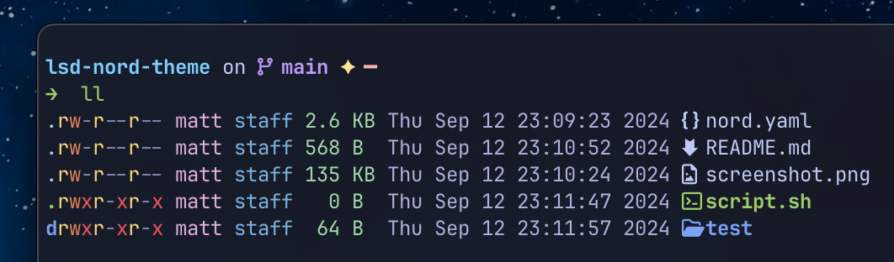

# `lsd` Nord color theme

Screenshot example



## References

- [`lsd` (improved `ls`)](https://github.com/lsd-rs/lsd)
- [Nord color pallet](https://www.nordtheme.com/)
- [starship shell prompt](https://starship.rs/)

## Setup

1. Modify the `lsd` config file

    ```bash
    vim ~/.config/lsd/config.yaml
    ```

2. Add/set the following property in that config file

    ```yaml
    color:
        theme: custom
    ```

3. Copy over the Nord color config file for `lsd` to read it

    ```bash
    cp nord.yaml ~/.config/lsd/colors.yaml
    ```
